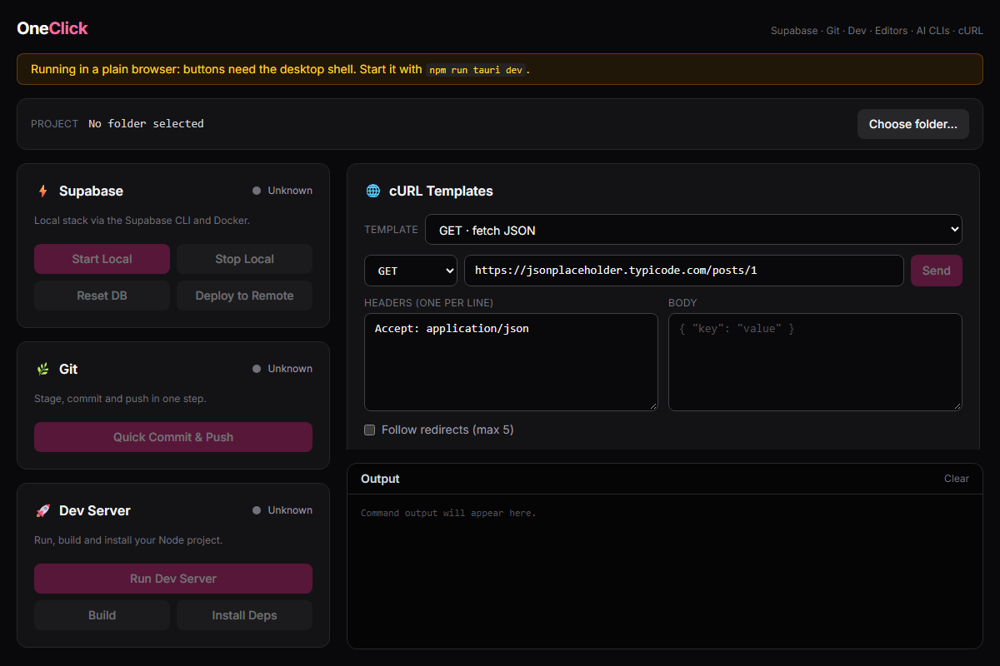
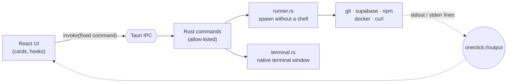

<div align="center">

# OneClick

**Stop retyping the same terminal commands. Run your whole dev workflow from one window.**

Supabase · Git · Dev servers · VS Code / Cursor / Antigravity · Claude Code / Codex · cURL, all one click away.

[](LICENSE)




<sub>UI preview rendered in a browser. In the desktop app every button is live.</sub>

</div>

---

## Why OneClick?

A normal day of local development looks like this: open a terminal, `cd` into the project,
`supabase start`, `npm run dev`, open the editor, launch your AI assistant, `git add . && git commit -m … && git push`,
then dig through shell history for that one `curl` you wrote last week.

OneClick turns each of those into a **button**, with live output, status lights and safe
confirmations for anything destructive. It is a small (Tauri, not Electron) native app that
does not replace your tools. It just drives the ones you already have installed.

## Features

| Card | Button | What it runs |
| --- | --- | --- |
| **Supabase** | Start Local | `supabase start` |
| | Stop Local | `supabase stop` |
| | Reset DB | `supabase db reset` (asks first) |
| | Deploy to Remote | `supabase db push --yes` (asks first) |
| **Git** | Quick Commit & Push | `git add .` → `git commit -m "<message>"` → `git push` (publishes new branches with `-u origin`) |
| **Dev Server** | Run Dev Server | `npm run dev` (falls back to `start`) in its own terminal window |
| | Build | `npm run build`, streamed live |
| | Install Deps | `npm install`, streamed live |
| **Launch** | VS Code · Cursor · Antigravity | opens the project folder in the editor |
| | Claude Code · Codex | opens a native terminal in the project running the CLI |
| **Toolbox** | Git Pull | `git pull --ff-only` |
| | Recent Commits | `git log --oneline -n 15` |
| | Docker Containers | `docker ps` |
| | Environment Check | reports which tools are installed and their versions |
| | Open Terminal / Open Folder | native terminal or file manager at the project |
| **cURL Templates** | Send | a validated `curl` request built from a template you can edit |

Also included:

- **Live output panel** streams stdout and stderr as commands run.
- **Status lights** show Supabase running/stopped, Git branch and changed-file count, and whether dependencies are installed.
- **Smart package manager**: uses `pnpm`, `yarn` or `bun` automatically when it finds their lockfile, otherwise `npm`.
- **Tool detection**: editors and CLIs that aren't on your `PATH` are greyed out with a tooltip instead of failing.
- **Remembers your project** between launches.

## Quick start

> Already have Node, Rust and the Tauri prerequisites? Three commands:

```bash
git clone https://github.com/YOUR_USERNAME/oneclick.git
cd oneclick
npm install && npm run tauri dev
```

Click **Choose folder…**, pick a project, and start clicking. Otherwise follow the full guide below.

## Full setup guide

### 1. Install the prerequisites

| Requirement | Why | Check |
| --- | --- | --- |
| [Node.js](https://nodejs.org) **20.19+** | builds the React UI | `node -v` |
| [Rust](https://rustup.rs) (stable) | builds the desktop shell | `cargo --version` |
| Tauri system libraries | native window + webview | see your OS below |
| `git` | the Git card | `git --version` |

<details>
<summary><b>Windows</b></summary>

1. Install **Microsoft C++ Build Tools** (choose the *Desktop development with C++* workload).
2. **WebView2** ships with Windows 10 (1803+) and Windows 11. If missing, get the
   [Evergreen runtime](https://developer.microsoft.com/microsoft-edge/webview2/).
3. Install Rust from <https://rustup.rs> and Node.js from <https://nodejs.org>.
4. Open a **new** terminal so `cargo` and `node` are on your `PATH`.

</details>

<details>
<summary><b>macOS</b></summary>

```bash
xcode-select --install
curl --proto '=https' --tlsv1.2 -sSf https://sh.rustup.rs | sh
```

Install Node.js from <https://nodejs.org> or with `brew install node`.

</details>

<details>
<summary><b>Linux (Debian / Ubuntu)</b></summary>

```bash
sudo apt update
sudo apt install libwebkit2gtk-4.1-dev build-essential curl wget file \
  libxdo-dev libssl-dev libayatana-appindicator3-dev librsvg2-dev
curl --proto '=https' --tlsv1.2 -sSf https://sh.rustup.rs | sh
```

Other distros: see the official [Tauri prerequisites](https://tauri.app/start/prerequisites/).

</details>

### 2. Install the tools OneClick drives (all optional)

OneClick only uses what you have. Skip anything you don't need, and its button will be disabled.

| Tool | Install | Used by |
| --- | --- | --- |
| Supabase CLI + Docker | [Supabase CLI docs](https://supabase.com/docs/guides/local-development/cli/getting-started) (`scoop` on Windows, `brew` on macOS) and [Docker Desktop](https://www.docker.com/products/docker-desktop/) | Supabase card, Docker Containers |
| Claude Code | `npm install -g @anthropic-ai/claude-code` | Launch → Claude Code |
| Codex CLI | `npm install -g @openai/codex` | Launch → Codex |
| VS Code | enable the `code` command: *Command Palette → Shell Command: Install 'code' command in PATH* (Windows: tick "Add to PATH" in the installer) | Launch → VS Code |
| Cursor | *Command Palette → Install 'cursor' command* | Launch → Cursor |
| Antigravity | install with "Add to PATH" enabled so `antigravity` works in a terminal | Launch → Antigravity |
| `curl` | preinstalled on Windows 10+, macOS and most Linux | cURL Templates |

> **Rule of thumb:** if typing the command name in a fresh terminal works, OneClick can use it.
> Restart OneClick after changing your `PATH`.

### 3. Get the code and run it

```bash
git clone https://github.com/YOUR_USERNAME/oneclick.git
cd oneclick
npm install
npm run tauri dev
```

The first run compiles the Rust side (a few minutes). Later runs start in seconds with hot reload.

### 4. Build an installer

```bash
npm run tauri build
```

Installers land in `src-tauri/target/release/bundle/` (`.msi` / `.exe` on Windows, `.dmg` / `.app` on
macOS, `.deb` / `.AppImage` on Linux).

### 5. Verify your setup

Open OneClick, choose a project, and press **Toolbox → Environment Check**. You'll get a report like:

```
✓ git          git version 2.x  (C:\Program Files\Git\cmd\git.exe)
✓ node         v24.x
✓ npm          11.x
✗ docker       not found
✓ cursor       C:\Users\you\AppData\Local\Programs\cursor\...
```

Only `git`, `node` and `npm` are required. Everything else is optional.

## Using OneClick

**1. Choose a project.** Click *Choose folder…*. The choice is remembered.

**2. Click things.** Output streams into the panel at the bottom. Only one workflow runs at a time, so
buttons disable while something is running.

**Status lights**

| Light | Meaning |
| --- | --- |
| 🟢 green | Supabase running · Git clean · dependencies installed |
| 🟡 amber pulse | a workflow is running, or Git has uncommitted changes |
| 🔴 red | Supabase stopped · dependencies missing · not a Git repo |
| ⚪ grey | unknown (tool missing, Docker not running, or no `package.json`) |

**Dev Server.** *Run Dev Server* opens the server in a **separate terminal window**, because dev servers run
forever. Close that window to stop it. *Build* and *Install Deps* stream into the Output panel instead.

**Launch.** Editors open the folder directly. Claude Code and Codex open a new terminal in the project with
the CLI already running.

### cURL Templates

Pick a starting point from the dropdown, edit anything, and press **Send**. The response (status line,
headers and body) streams into Output. The exact `curl` command is shown below the form so you can
**copy it** into a script or a bug report.

Built-in templates:

| Category | Templates |
| --- | --- |
| Basics | GET fetch JSON · POST JSON · PUT · PATCH · DELETE · HEAD |
| Auth & formats | Bearer token · form-encoded POST · GraphQL query |
| Local dev | Ping your dev server (`localhost:5173`) |
| Supabase (local) | query a table · insert a row · Auth health · invoke an Edge Function |

- `YOUR_TOKEN`, `YOUR_ANON_KEY`, `YOUR_TABLE`… are **placeholders**. A warning stays visible until you replace them.
  Your local anon key is printed by `supabase status`.
- **Save as template** stores your own in the app's local storage. It is **not encrypted**, so keep placeholders
  in saved templates, not real secrets.
- Only `http://` and `https://` are allowed, and requests time out after 30 seconds.

## How it works



### Project layout

```
src/
  App.tsx                 layout, polling, project selection
  components/             one file per card (SupabaseCard, GitCard, DevCard, LaunchCard, ToolboxCard, CurlPanel)
  hooks/                  useRunner (one workflow at a time + log), usePolling (status lights)
  lib/api.ts              typed wrapper around every Tauri command
  lib/curlTemplates.ts    built-in cURL templates + "copy as curl" builder
src-tauri/src/
  runner.rs               safe process spawning + live output streaming
  commands.rs             Supabase + Git workflows, shared helpers
  devtools.rs             package-manager detection, install / build / dev server
  launch.rs               editors, AI CLIs, tool detection, terminal / file manager
  toolbox.rs              git pull / log, docker ps, environment check
  curl.rs                 validated curl request builder + runner (unit-tested)
  terminal.rs             cross-platform "open a terminal here"
```

## Security model

OneClick runs commands on your machine, so it is deliberately strict.

- **The webview has no shell or filesystem access.** It can only call the 13 fixed Rust commands registered in
  `src-tauri/src/lib.rs`. It cannot submit an arbitrary command line.
- **No shell, ever.** Processes are spawned directly with each argument passed separately, so a commit message
  like `"; rm -rf /` is just text.
- **cURL is the one flexible command**, so its input is validated and hardened (`src-tauri/src/curl.rs`):
  the method comes from an allow-list; the URL must be `http(s)` with no whitespace; header names are validated;
  `-q` ignores any `~/.curlrc`; `--proto` blocks `file://`, `ftp://` and friends; `--data-raw` means a body
  starting with `@` is sent as text, never read from a file; `--globoff` stops `[1-100]` URL expansion.
  These behaviours are covered by unit tests.
- Executables are resolved from your `PATH`. Only run OneClick on machines whose `PATH` you trust.

Found a vulnerability? Please open a private security advisory on GitHub rather than a public issue.

## Troubleshooting

| Symptom | Fix |
| --- | --- |
| Buttons do nothing / banner says "plain browser" | You ran `npm run dev`. Use **`npm run tauri dev`** for the desktop app. |
| `` `supabase` was not found on your PATH `` | Install the CLI, then **restart OneClick** so it sees the new `PATH`. |
| Supabase light is grey: "Docker doesn't appear to be running" | Start Docker Desktop, then wait for the next status refresh. |
| An editor button is greyed out | Its command isn't on `PATH`. See the install table above (e.g. *Install 'code' command*). |
| `error: linker link.exe not found` (Windows) | Install Microsoft C++ Build Tools with the *Desktop development with C++* workload. |
| Linux: `webkit2gtk` errors at build time | Install the Linux packages listed in step 1. |
| Port `1420` already in use | Another `vite` is running. Stop it, or change the port in **both** `vite.config.ts` and `src-tauri/tauri.conf.json`. |
| Git push fails with an auth error | OneClick can't prompt for credentials. Sign in once in a terminal (or use a credential manager / SSH key). |
| "Nothing to commit; pushing existing commits." | Expected when the working tree is clean. |

## Contributing

Contributions are welcome. The codebase is small on purpose.

### Add a new button in four steps

1. **Rust:** add a variant to an action enum (or a new `#[tauri::command]`) in the right module. Use `run_streamed`
   for output you want in the panel, or `terminal::open` for long-running processes.
2. **Register it** in `tauri::generate_handler![…]` in `src-tauri/src/lib.rs`.
3. **Type it** in `src/lib/api.ts`.
4. **Add the button** to a card in `src/components/` and wrap the call in `runner.run("Label", …)`.

Rules of the road: never build a command line from user text. Pass arguments as separate strings, validate
anything user-supplied, and add a unit test when you do.

### Run the checks

```bash
npm run build                        # type-check + production UI build
cargo test --manifest-path src-tauri/Cargo.toml
```

### Ideas for contributions

- More launchers (Windsurf, Zed, JetBrains, Gemini CLI)
- `pnpm` / `yarn` script picker beyond `dev` and `build`
- Cancel button for long-running workflows
- Per-project settings and saved cURL environments
- Signed release builds and auto-update

## License

[MIT](LICENSE)
